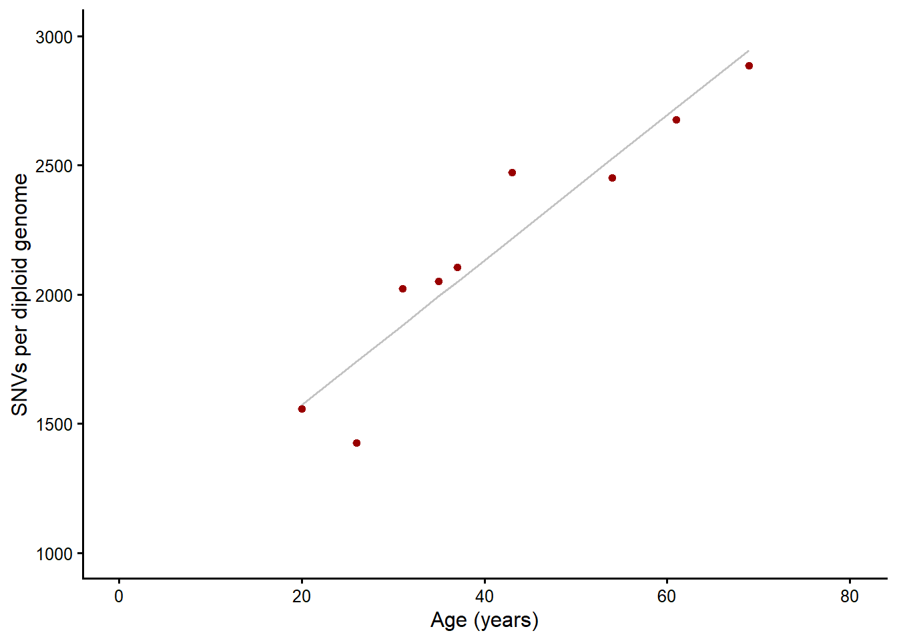

  

# SomaticCODEC
**SomaticCODEC is a sequencing assay for quantifying somatic mutation burden**

The assay combines a modified CODEC sequencing protocol with a Snakemake-based analysis pipeline to accurately measure somatic single-nucleotide variants across the full variant allele frequency (VAF) spectrum. Many sequencing pipelines are optimised for high-VAF variants, whereas SomaticCODEC is designed to quantify somatic variants across both low and high VAFs.

Applications include ageing research, mosaicism studies, and preventative cancer genomics. The pipeline’s modular design enables adaptation to other use cases (e.g. tumour biology), although re-validation would be required.

SomaticCODEC comprises a laboratory protocol for library preparation ([Phie *et al*. 2026]()) and a bioinformatics pipeline for analysing the resulting sequencing data ([Johnstone *et al*. 2026]()).

### Key features

- **Optimised for normal tissue**, where somatic variants often occur at low frequencies
- **Duplex error correction** substantially reduces sequencing error rates
- **Extensive assay validation** with >80 component-level and >10 system-level performance metrics, predefined thresholds, and automated reporting
- **Cloud-ready** containerisation enables deployment anywhere, with optimisation for AWS
- **Robust software engineering**: modular design, version control, reproducible environments, and comprehensive unit testing

### User guide

- [Assay overview](docs/user_guide/assay_overview.md)
- Before running the pipeline
  - [Generating sequencing data](docs/user_guide/generating_sequencing_data.md)
  - [Preparing sample sheets](docs/user_guide/sample_sheet_setup.md)
  - [Obtaining reference files](docs/user_guide/obtain_reference_files.md)
  - [Setting up compute platform](docs/user_guide/compute_setup.md)
  - [Selecting a profile](docs/user_guide/profiles.md)
- [Running the pipeline](docs/user_guide/run_pipeline.md)
- [Interpreting outputs](docs/user_guide/interpreting_outputs.md)
- [Troubleshooting](docs/user_guide/troubleshooting.md)

### Example results

The figure below was created in R using ggplot2 from data generated by SomaticCODEC from human blood samples.

  

### Development
This repository is developed and maintained by [Systematic Medicine Pty Ltd](https://systematicmedicine.com). We are not currently accepting external pull requests, but bug reports and issue discussions are welcome via GitHub Issues.

- [Rulegraph](docs/figures/variant_calling_rulegraph.svg)
- [Repository structure](docs/development/respository_structure.md)
- [Change control](docs/development/change_control.md)
- [Software testing](docs/development/software_testing.md)
- [Adapting to other use cases](docs/development/other_use_cases.md)

 

