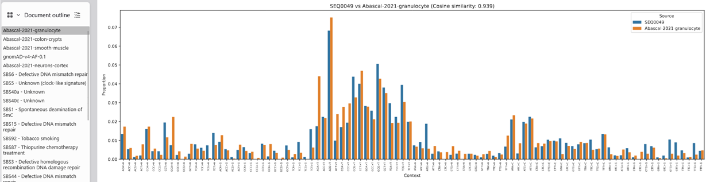

# Interpreting pipeline outputs

### Called variants

* Called SNVs can be found in `results/{ex_sample}/{ex_sample}_called_snvs.vcf`
* SNV rate can be found in `results/{ex_sample}/{ex_sample}_somatic_variant_rate.json`

### System level performance metrics

System-level metrics measure the performance of the entire assay. The description for each metric can be found in `system_level_metrics.xlsx` for each profile.

All system level performance metrics that can be assessed during routine usage can be found in `results/system_metrics_report.csv`

A graphical version of the report can be found at `results/system_metrics_report.png`

### Component level performance metrics

Component-level metrics measure the performance of individual assay components. The description for each metric can be found in `component_level_metrics.xlsx` for each profile.

All component level metrics that can be assessed bioinformatically can be found in `metrics/component_metrics_report.csv`

A graphical version of the report can be found at `results/system_metrics_report.png`

### Metrics thresholds

Thresholds for each component and system level metric were established using a combination of internal data (~20 batches) and first-principles reasoning.

These thresholds are intended as a guide for troubleshooting assay performance. Results may differ if different wet-lab, sequencing, or bioinformatic parameters are used.

### Additional metrics
Additional metrics files are generated that are not included in the automated report. These can be found in the `metrics/` and `results/` directories.

Some notable files:

- `results/{ex_sample}/{ex_sample}_trinuc_plots_normalised.pdf`
- `results/{ex_sample}/{ex_sample}_snv_position_plot.pdf`
- `metrics/ex/{ex_sample}/{ex_sample}_dsc_coverage_plot.html`
- `metrics/ex/{ex_sample}/{ex_sample}_insert_metrics.pdf`
- `metrics/ms/{ms_sample}/{ms_sample}_insert_metrics.pdf`

 

  

*Example trinucleotide context report, comparing the sample to several reference contexts*